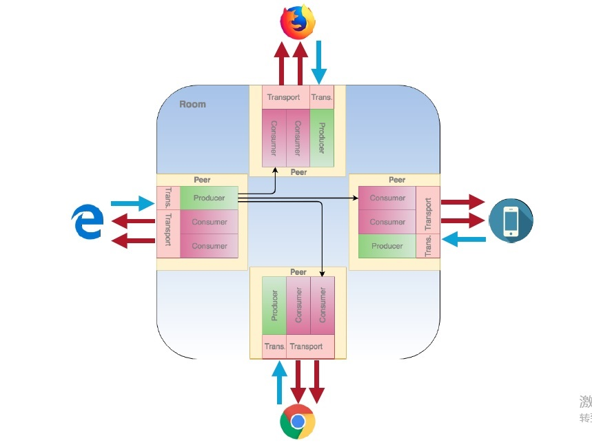

### 编译windows
 
1.生成VS项目文件 

set DEPOT_TOOLS_WIN_TOOLCHAIN=0 

set GYP_GENERATORS=msvs-ninja,ninja 

set GYP_MSVS_VERSION=2015 

python webrtc/build/gyp_webrtc.py

2.编译调试 

以VS2015为例，用VS2015打开all.sln 

将webrtc项目下example下的peerconnection_client设为启动项

### 开源框架介绍

#### mediasoup

github地址：

https://github.com/versatica/mediasoup-client

https://github.com/versatica/mediasoup

mediasoup是一个开源的SFU实现，支持基于webrtc的多方会议。此软件框架包括：

mediasoup-client：是一个javascript sdk，支持浏览器。

mediasoup：是一个服务器，包含一个基于node.js的应用实现部分，和worker部分。worker部分主要提供媒体部分，支持rtcp等反馈机制。
mediasoup是ice的Lite实现，所以没有candidates收集，连接check机制。

多方会议模型：

room:代表一个会议室

peer:表示参会终端，比如一个浏览器，或者是一个webrtc app终端。

producer:是媒体共享端

consumer: 媒体观看端

一个room会有多个表示多方参会终端的peer。

一个peer会包含若干producer和若干consummer，前者是共享媒体，后者是观看媒体。
同时，每一个Peer包含若干consumer对象，每一个consummer和其他peer的producer一一对应，表示接收其他producer的媒体流。

包含的信令：

1. queryroom, 向服务器查询支持的媒体能力

2. join，加入会议室，此时会创建peer，同时会遍历room中的所有peer，为当前peer创建好consumer，准备接收其他peer的媒体流。

2. createProducer，产生producer对象，准备共享流

3. enableConsumer，打开接收媒体流权限。

还有其他操作，后续补充。。。

#### licode

架构：

github地址：

https://github.com/lynckia/licode

##### 代码结构

erizo: ice协议，媒体实现部分，c++实现

erizo_controller

   +--------erizoAgent ---js实现，是一个worker进程实现。主要是通过nodejs启动进程，加载c++实现。
   
   +--------erizoClient ---js实现，是一个浏览器客户端的实现
   
   +--------erizoController ---js实现， erizoClient对应的服务器实现，websocket协议实现。
   
   +--------erizoJS ------js实现，由erizoAgent调用，主要是和c++部分交互。
   
erizoAPI: 通过addon暴露nodejs接口，主要是erizo的wrapper。

NUVE: 应该是多方会议逻辑实现

### WebRTC 的 DataChannel 采用 SCTP 协议。

https://bloggeek.me/sctp-data-channel/

### Resource

一些资源：

https://www.html5rocks.com/en/tutorials/webrtc/basics/

基于webrtc的网络语音视频服务，是收费服务。

https://www.simplewebrtc.com

csdn资料：

https://blog.csdn.net/foruok/article/details/53005728

github：

https://github.com/webrtc

jsep:

https://rtcweb-wg.github.io/jsep/

licode:
https://zhuanlan.zhihu.com/p/40462946

licode&kurento&kurento:
https://blog.csdn.net/xiaoluer/article/details/79088416

SFU:
https://tools.ietf.org/html/rfc7667

webrtc浏览器接口文档说明：
https://developer.mozilla.org/en-US/docs/Web/API/MediaStream

webrtc相关术语解释：
https://webrtcglossary.com/plan-b/

webrtc 多方架构
https://bloggeek.me/webrtc-multiparty-architectures/

https://bloggeek.me/webrtc-multiparty-video-alternatives/

https://testrtc.com/different-multiparty-video-conferencing/
